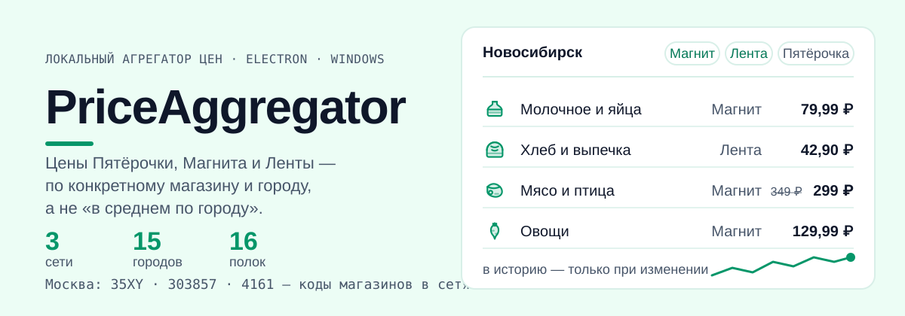

# PriceAggregator



Локальный агрегатор цен продуктовых магазинов (Пятёрочка / Магнит / Лента).
Desktop-приложение под Windows. Open source, использование личное.

## Что делает

- Сравнение цен одного товара в разных сетях с разделением по городам.
- История изменения цен с датой замера (график в карточке товара).
- Свои категории товаров: 16 полок, раскладка по поисковым запросам сетей,
  many-to-many (у сетей товар лежит в разных полках, у нас в своих).
- Автообновление exe из GitHub Releases.

Ключевой принцип: сеть опрашивается по расписанию (без запроса изменение
не узнать), а в историю пишется только если цена/промо/наличие изменились.

## Сети

| Сеть | Транспорт | Города | Статус |
|---|---|---|---|
| Магнит | fetch к сайту | **15 городов**: Москва, СПб, Ульяновск, Краснодар, Иркутск, Новосибирск, Екатеринбург, Казань, Нижний Новгород, Челябинск, Красноярск, Пермь, Барнаул, Омск, Кемерово | работает; справочника городов у сети нет, код точки надо знать |
| Пятёрочка | fetch + браузерный транспорт (Playwright Firefox) | Москва | работает, остальные города недоступны по IP |
| Лента | fetch к скрытому API | **15 городов**: Москва, СПб, Новосибирск, Екатеринбург, Казань, Нижний Новгород, Челябинск, Красноярск, Пермь, Барнаул, Омск, Кемерово, Ульяновск, Краснодар, Иркутск | поиск и цены работают; каталога пока нет — форма ответа известна, но Qrator не пускает браузерный профиль приложения (см. ниже) |

Коды магазинов печатаются зондами: `npm run magnit:store`, `npm run lenta:store`.
Справочник регионов Ленты (93 региона, 1020 точек) лежит в
`src/shared/lenta-regions.ts`, пересобирается `npm run lenta:regions`. Важно:
slug региона **не совпадает** с названием города и не выводится из него —
Новосибирск это `nsk`, Екатеринбург `ekb`, Нижний Новгород `nnov`, Краснодар
`ksdr`. Ошибиться здесь нельзя: подставишь свой — всё уедет в 401.

### Города и сети

Код в скобках — код магазина в сети (`sapCode` / `shopCode` / `storeId`).

| Город | Сети |
|---|---|
| Москва | Пятёрочка (35XY), Магнит (303857), Лента (4161) |
| Санкт-Петербург | Магнит (277027), Лента (3135) · Пятёрочка недоступна по IP |
| Новосибирск | Лента (3311), Магнит (543579) |
| Екатеринбург | Лента (3481), Магнит (099255) |
| Казань | Лента (3181), Магнит (747996) |
| Нижний Новгород | Лента (3170), Магнит (633408) |
| Челябинск | Лента (3483), Магнит (740682) |
| Красноярск | Лента (3491), Магнит (432925) |
| Пермь | Лента (3567), Магнит (593395) |
| Барнаул | Лента (3563), Магнит (221456) |
| Омск | Лента (3441), Магнит (558755) |
| Кемерово | Лента (3517), Магнит (427498) |
| Ульяновск | Магнит (730159), Лента (3275) · Пятёрочка недоступна по IP |
| Краснодар | Магнит (010033), Лента (3208) |
| Иркутск | Магнит (540675), Лента (3621) |

Город добавлен, если сеть отдаёт по нему непустую выдачу с ценой — проверено
живым поиском для каждой строки без пометки. У Пятёрки сеть сама выбирает
магазин по IP, и подменить город из кода нельзя (кука и localStorage
перезаписываются сайтом), у Магнита справочника городов не существует — код
точки надо знать.

**Как проверяется код Магнита.** Первая проверка искала в HTML строку
`shopCode=<код>` — и этого мало: сайт подставляет её эхом нашей куки
даже для несуществующего кода, так что она принимала ЛЮБОЙ код (проверено живьём
на `111111`). Теперь сверка идёт по ссылкам на товары: они ведут в тот
магазин, чьи цены показаны. Коды городов проверены живым поиском
2026-10-01; код Екатеринбурга пишется с ведущим нулём (`099255`), без него сайт
подставляет магазин по умолчанию.

**Код магазина в СПб пришлось заменить.** Прежний `501478` перестал отдавать
выдачу: 2026-10-03 прямой поиск вернул «search-парсер пуст при живом shopCode»,
тогда как остальные города отдали 24–32 товара. Новый код `277027` в тот же день
отдал 30 товаров с ценами (`fetchProduct` вернул ту же цену), и он же проверен
вместе со всеми пятнадцатью городами живым поиском.

**Что сделать руками в своей базе.** Ключ истории — `(canonical_id, store_id,
city)`, кода магазина в нём нет, поэтому старые точки СПб по Магниту остались в
`prices_history` и склеятся с новыми. Удали их:
`DELETE FROM prices_history WHERE store_id = 'magnit' AND city = 'saint-petersburg'`.
Без этого график СПб покажет две разные точки, а первая запись после смены кода
будет выглядеть как резкое изменение цены.

**Почему у Ленты пока нет каталога.** Форма ответа известна, а вот добраться
до неё из приложения не получается. `Node fetch` в каталог не ходит вовсе:
`GET` на api-gateway отдаёт 401 (в том числе карточка товара и список разделов),
`POST` по пути каталога — 405, jrpc-метод дерева разделов требует
пользовательский Passport-токен, который приложение не берёт. Остаётся браузер,
и там упираемся в Qrator: `npm run lenta:browser` запускает настоящий Firefox и
получает на главной 401 с челленджем, кука `qrator_jsr` ставится, но после
перезагрузки Qrator отвечает «Доступ к сайту lenta.com запрещен». Проверено и
с нашего адреса, и с домашнего — свой браузер у пользователя сайт открывает, а
автоматизированный профиль нет, то есть фильтр по профилю, а не по IP.

Сами данные каталога при этом получить удалось: из HAR рабочего браузера
вынуты 1433 раздела (дерево из четырёх уровней) и постраничная выдача товаров с
`limit`/`offset`. Формы сохранены фикстурами
(`tests/fixtures/lenta-catalog-*.json`) вместе с проверками нормализации цен,
поэтому транспорт можно доделать без повторного захвата. Мы не решаем челлендж
в коде и не подставляем куки руками; рабочий путь — обычный браузер с
собственным сеансом. Диагностика: `npm run lenta:probe`, `npm run lenta:browser`.

## Из чего сделано

- Node 22 + TypeScript (strict + exactOptionalPropertyTypes)
- Electron (main/preload) + Vite + React (renderer)
- SQLite через `sql.js` (WASM — собирается везде без компилятора C++), файл `prices.db` в `%APPDATA%\price-aggregator` (см. «Данные и резервная копия»)
- Сборка Windows: `electron-builder` (NSIS-установщик + portable exe)
- Обновления: `electron-updater`, GitHub Releases как источник
- Версия одна — файл `VERSION` в корне, `npm run version:sync` пишет её в package.json

## Структура

```
electron/            оболочка: окно, IPC, автообновления (только Electron)
src/core/            ЯДРО: адаптеры сетей, БД, планировщик, бизнес-логика
  platform.ts        порты платформы (хранилище, кэш, уведомления, таймеры)
  services.ts        вся бизнес-логика: поиск, каталог, история, опрос
src/renderer/        React-интерфейс
src/shared/          контракты и справочники, общие для всех оболочек
scripts/             sync-version, зонды сетей, генераторы, тесты
tests/fixtures/      слепки ответов API сетей для unit-тестов адаптеров
```

Ядро не знает про Electron и про `node:fs`: всё, что платформенно, берётся
через порты из `src/core/platform.ts`. Поэтому оно запускается под обычным
node в тестах (`npm run test:core` проверяет и это, и запрет на импорты
Electron/`node:*` внутри ядра) и может быть reused второй оболочкой — Android
на Capacitor, если дойдёт.

## Данные и резервная копия

История цен, избранное и разрывы товаров лежат в одном файле SQLite: `prices.db`.
Рядом с ним приложение держит пересобираемый кэш витрин `catalog-*.json` — его
можно удалять в любой момент, он не данные (правило 5: цена живёт в БД).

Путь один для обеих сборок: `%APPDATA%\price-aggregator\prices.db`
(на Windows это `C:\Users\<юзер>\AppData\Roaming\price-aggregator\prices.db`).
Имя каталога берётся из `name` в package.json, а не из `productName` сборки —
проверено на живой установке.
Portable-сборка **не** держит базу рядом с `.exe` — переносить её с собой нужно
этим файлом, иначе на новой машине история цен и избранное будут пустыми.

**Копия = скопировать `prices.db` при закрытом приложении.** Штатной кнопки в
приложении нет и не планируется: база пишется по расписанию опроса, и
снапшот изнутри означал бы либо блокировку на время записи, либо забытый
хвост данных. Копия нужна перед обновлением приложения и перед переносом на
другой компьютер.

Восстановление — положить файл на место. Формат не документирован и меняется
вместе со схемой (`src/core/db/schema.sql`), поэтому откат на старую версию
приложения может не открыть базу — это честное ограничение, а не недоработка.
Копия `prices.db` закрывает данные сразу; кэш витрин можно не брать.

## Цены и города

У сетей нет «цены города» — цена всегда конкретного магазина:
Пятёрочка — `sapCode`, Магнит — `shopCode` (кука), Лента — `storeId`.
Новый город = новая строка в таблице `stores`. Ключ цены:
(canonicalId, storeId, city).

Важно: цены могут различаться даже между соседними магазинами одной сети
в одном городе (проверено на Магните) — сравнение честно только в пределах
выбранного магазина, приложение так и показывает.

Адаптеры неофициальные (скрытые API сайтов; у Ленты — JSON-RPC, который
сайт зовёт сам). Только для личного пользования; уважать rate-limit,
секреты — в `.env`.

## Сборки

```
npm run build:win   # установщик + portable -> dist/setup/ и dist/portable/
```

Сборка разложена по папкам, чтобы при выкладке на GitHub Releases не перепутать
файлы: `dist/setup/` — установщик, его `.blockmap` и `latest.yml` (всё это нужно
загрузить в релиз), `dist/portable/` — портативный exe (в автообновлении он не
участвует).

Одна сборка, ~206 МБ. X5 (Пятёрочка) режет всё, что не настоящий браузер: и
curl, и fetch, и Chromium — проходит только Playwright Firefox. Браузер (342 МБ
развёрнутых) лежит в `resources/browsers` рядом с exe: рабочий каталог
упакованного приложения равен папке установки, и `.playwright-browsers` там не
ищется.

Лёгкой сборки без браузера больше нет. Экономия в 88 МБ не окупала того, что
Пятёрочка в ней не работала; вариант «докачать браузер по кнопке» тоже отпал:
архив Firefox весит 122 МиБ, и лёгкая сборка с докачкой (117 + 122 = 239 МБ)
оказалась бы тяжелее нынешних 206 МБ.

В `resources/browsers` едут `firefox-*` и `winldd-*` (0,25 МБ). `winldd`
обязателен не для запуска Firefox, а для проверки зависимостей, которую
Playwright повторяет раз в 30 дней: без него на 31-й день установленное
приложение падало бы с «Executable doesn't exist at …/winldd». Версия браузера
проверяется по ревизии из `browsers.json`, поэтому после обновления Playwright
нужно перекачать браузер и пересобрать (`npm run build:win`).

Автообновление ставит установщик NSIS. **Portable-версия сама не обновляется**:
electron-builder не делает для portable blockmap, и `latest.yml` всегда указывает
на установщик. Portable — для запуска без установки, обновлять её надо вручную.
Зато portable один раз при запуске спрашивает ленту релизов и, если версия новее,
показывает уведомление: клик открывает страницу релизов. Работает только с
релизом, опубликованным **без** метки pre-release (лента `/releases/latest/` их не
отдаёт) и с приложенным `latest.yml` — штатный `npm run release:win` кладёт и то,
и другое сам. После публикации стоит убедиться, что лента отвечает:
`https://github.com/Far-g-Us/price_aggregator/releases/latest/download/latest.yml`
должен вернуть `version: <версия>`, иначе portable будет молчать (в логе это видно
как `release feed 404`).

## Команды

```
npm run dev              # Electron + Vite HMR
npm run version:sync     # VERSION -> package.json
npm run typecheck        # оба tsc-конфига
npm test                 # юнит-цикл: ядро, адаптеры, матчинг, БД, планировщик
npm run lenta:store -- spb     # точки Ленты в городе: код для catalog.ts
npm run lenta:regions          # пересобрать справочник регионов Ленты
npm run lenta:probe            # живой зонд Ленты (из домашней сети)
```

Playwright-браузеры качаются только в проект (нужны для сборки и для dev):
`PLAYWRIGHT_BROWSERS_PATH=.playwright-browsers npx playwright install firefox`.

## Статус

MVP в разработке. Работают Магнит (15 городов), Пятёрочка (Москва) и Лента
(15 городов) — поиск, цены, история, планировщик опроса, свои полки с ручной
раскладкой. Каталог магазина («Как в магазинах») работает у Пятёрки и Магнита;
у Ленты он пока не подключён: форма ответа снята и лежит в фикстурах, а доступ
из приложения режет Qrator (см. выше). Подробности и следующие шаги — в
`ROADMAP.md`.

Хотите помочь — см. [`CONTRIBUTING.md`](CONTRIBUTING.md): как поднять проект,
какие проверки обязательны перед PR и какие правила действуют для адаптеров сетей.
